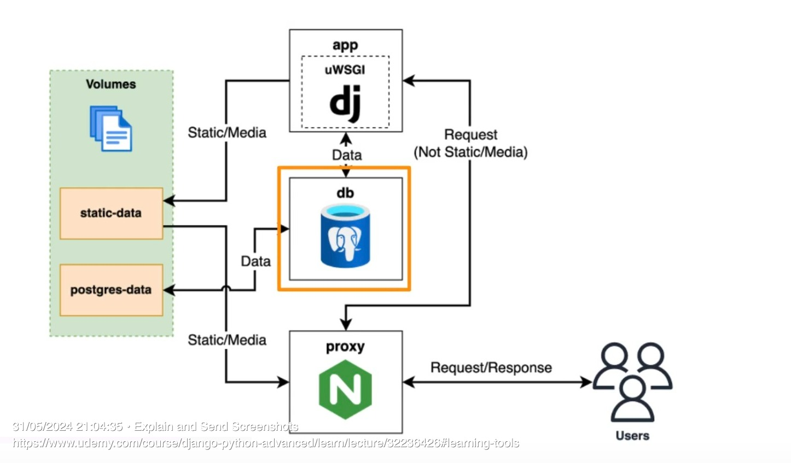

# DiagnosticTestRecommender API

## What does this project do
1. This is a ready to go Django REST API project template
2. It has a complete CICD pipeline using GitHub Actions
3. The CICD Pipeline includes, linting, testing and deployment.
4. The project can be deployed locally as well as to the cloud like AWS or any other cloud servide.
6. It exposes REST endpoints that allow us to create/update/delete users who will be accessing this endpoint
7. It exposes REST endoints that allow us to create/update/delete an entity.
9. It provides the capability to assign tags to the entity being exposed and also has a search capability that allows us to filter the entity based on these tags.
10. It also has API documentation implemented.

## Motivation behind this project
1. While working on real world projects or ideas, we spend more time on tasks like project setup, cicd pipeline set up, deployment, documentation than on the actual implementation of our idea.
2. This project provides you a boiler plate project template with all the necessary things built in.
3. All you need to do is download this code base and follow a few simple steps to get it running on your machine or on AWS.
4. Then you can extend the logic inside this already deployed project to suit your needs.

## Contents of this code base
This code base as mentioned above is a Django REST API application.
It has the following folders at the root level :
1. .github/workflows -  This is a yaml configuration file is used by github actions for the cicd pipeline. We define what actions we want github to run when we push code to the master branch.
2. app folder - This contains all of the Django project files. It consists of the the multiple django apps we define for our application. It has the following contents:
   - manage.py : It is command-line utility for Django projects. It is generated automatically. It is placed in the root directory of the current project. It sets the DJANGO_SETTINGS_MODULE environment variable to point to the project’s settings.py file.
   - app : This is the main Django app folder that consists of the main Django files like settings.py, the urls that are exposed , the swagger documentation url etc..
        - __init__.py : the __init__.py file is used to mark a directory as a Python package. it comes by default when you create a Django project
        - asgi.py : As well as WSGI, Django also supports deploying on ASGI, the emerging Python standard for asynchronous web servers and applications. Django’s startproject management command sets up a default ASGI configuration for you, which you can tweak as needed for your project, and direct any ASGI-compliant application server to use.
        - settings.py : The settings.py file is the central one for configuring all Django projects. It is nothing else than a Python module with defined variables. All variables inside are constants, and according to PEP 0008 convention, they should be written with capital letters.
        - urls.py : This is the entry point for the project. Contains the root URL configuration of the entire project
        - wsgi.py : It is mostly used during deployment. It is used as an interface between application server to connect with django or any python framework which implements wsgi
    - images : We store any images we use in the readme file here.
    - proxy : We use a proxy to direct requests that come to the application. Any request for a static file like html, css, images etc.. is routed to the web server. Any other request is routed to the wsgi server. The contents of the proxy folder are:
        - We are going to be using an application called nginX for our web server, and in order to use nginX, we need to add some configuration files to our product that tell nginX how to run our application.
        - default.conf.tpl : template configuration file that's going to be used by our Docker file in order to apply the custom configuration values to the application. The reason why we call it .TPL is because we're not going to be using this file directly when we run our proxy. We're going to be passing it through something in order to set some values in the file that sets the real file on the server.
        So the main block we have here starting on line one is the configuration block for the server.
        Listen_port is the port that the server will be listening on. Its set using an environment variable thats passed to our application
        location blocks are ways that you can map different URL mappings for that passed into the server requests and you can map them to different places on the system.
        So any your row that starts with /static will go to an alias called Vol/Static which has a volume containing the static and media files for our application.
        The next location block handles all the requests that aernt met by the above location block.
        So nginx will first check if the request matches /static. If it does then it will pass it to alias and stop executing the request. if it doesnt match then  it will pass it to the second location block.
        In the second config block, we are configuring the server by app host and app port. this will tell the nginx server what host and port on the uwsgi server to connect to.
        Include helps us include the uwsgi parameters which are required for the http request to be processed in wsgi
        Next, we have client max body size. This is the maximum body size of the request that will be passed. So it basically means here that the maximum image that can be uploaded will be ten megabytes.
        - Uwsgi_params - required for the http request to be processed in wsgi
        - Run.sh : Shell script that starts our proxy service
    - scripts : This consists of a run.sh file which is run once all of our application components i.e the webserver, wsgi server , database etc... are up
    - .dockerignore :  A .dockerignore is a configuration file that describes files and directories that you want to exclude when building a Docker image
    - .env.sample : It consists of the environment variables wihch are used in our docker-compose-deploy.yml. This file is renamed to .env when deploying.
    - .gitognore : Files that should be ignored by git.
    - .flake8 : We use flake8 for linting. This file tells flake8 which files to ignore.
    - docker-compose-deploy.yml : This is the docker-compose file thate used for build and deployment in the cloud once its set up.
    - docker-compose.yml : This is used for build and deployment on the local machine.
    - Dockerfile : This is the docker file which is used to build the Docker Image.
    - requirements.dev.txt : Mentions all the python dependencies in the dev environment
    - requirements.txt : Mentions all the python dependencies in the prod environment.

    - core : We use this Django app to manage the admin functionalities of our project. It has the following contents:
        - management/commands/wait_for_db.py : In this project we have the database and application on the same docker image which we will install on a server. So we want the application to come up only after the database is available so that when we run the migrations, the db is available. So we created this wait for db command which we call before calling the main application. If we have a remote database, then we dont need to have this command.
        - migrations : The files in this folder are autogenerated. These are the database scripts which are generated based on the models we create in the models.py file
        - tests : This folder consists of the unit tests for this app.
        - admin.py : We customise the Django admin page in this file
        - models.py : This file consists of the database tables we need and their fields etc..
        - apps.py : This is generated by default by Django. It is used by Django when we run the application to create a class for each of the apps using this file if it exists. Otherwise it will use the base AppConfig.

    - user : We use this Django app to manage everything about the users who will access our APIs.
        - tests : This folder consists of the unit tests for this app.
        - apps.py : This is generated by default by Django. It is used by Django when we run the application to create a class for each of the apps using this file if it exists. Otherwise it will use the base AppConfig.
        - serializers.py : In this file we create the serializers for the User model.
        - urls.py : We create the url patterns we want for user. So once the user url is added to the urls.py in the app folder, all the url pattenrs of user will be accessible to a user.
        - views.py : We create the views for the user which are used in the serializer.

    - diagnostictest : We use this Django app to manage everthing about the diagnostictest entity and the tags entity which we use to filter diagnostictests by.
        - tests : This folder consists of the unit tests for this app.
        - apps.py : This is generated by default by Django. It is used by Django when we run the application to create a class for each of the apps using this file if it exists. Otherwise it will use the base AppConfig.
        - serializers.py : In this file we create the serializers for the diagnostictest and tags models.
        - urls.py : We create the url patterns we want for diagnostictests and tags. So once the diagnostictest and tags urls are added to the urls.py in the app folder, all the url pattenrs of diagnostictest and tags will be accessible to a user.
        - views.py : We create the views for the diagnostictest and tags which are used in the serializer.

Explain the general content of this code base i.e the different folders and files. What do the various apps do, what auth do we use, where do we run the admin from or models or testing etc... What do we use for linting, testing, api docs etc..

## Build & Deploy this project locally

## Documentation & Usage post local deployment

## Build & Deploy this project to the AWS Cloud

## Documentation & Usage post cloud deployment

## Commonly used Commands

## Quick summary of some Django Concepts
1. Why do we need an __init__.py
2. Get some info on how models, views, serialisers , urls interact with each other. What objects are passed and how to access some of the often used data in them. For example how do we get the current user in a view , serialiser etc..
3. What are mixins and how do they work? https://medium.com/silicon-tribe-techdev/mixins-and-viewclasses-in-django-rest-framework-5dcd3a42617d
4. What do we do if we want to create a new API based on a new model.

## Troubleshooting
1. Sometimes when we make changes to the settings or other files and you get weird errors, try to build the project again and then run the application.
2. Dockerfile name
3. Versions of things like docker, docker-compose if you are using this project in the future.
4. Sometimes when we make changes to the settings or other files and you get weird errors, try to build the project again and then run the application.

## Deployment
### Steps
1. Setup a proxy (reverse proxy)
2. Handle Static & media files through this proxy
3. Cofigure our app on the server.

### Components
1. WSGI service - WebserviceGatewayInterface that runs the python code that powers our Django application
2. Persistant Data - When we use containers like Docker etc.., these are stateless ie they shouldnt store any data related to the current state of the application. For example if a user uploads a file, it should be stored in a persistent volume that can be accessed by the containers that are running or other containers that you store in your service.
3. Reverse Proxy - So this is what's going to accept the requests into our application. So any request that comes from the Internet, it's not going to go directly to our Django service or WSGI service. It's going to go through a proxy. The reason we need a proxy is due to the following reason :
A WSGI server is great at executing python code but its not effecient at executing Javascript, static content like images etc... especially when the load is high. A webserver on the other hand is great at handling these types of requests. So we set up a reverse proxy using a web server application that allows us to serve files that the webserver serves effeciently and sent the rest to the WSGI server so that it can be handled by the python code.

### Applications
1. nginx - a webserver . its open source, fast and production grade. We use it to set up the reverse proxy
2. uWSGI - the wsgi server
3. Docker Compose - to pull all these services together and serve them on our server.

### Diagram of different services and volumes

1. App service will be used to run our application using the uWSGI server. This will server our Django Application
2. We will be using a Postgres database to store the persistent data
3. The proxy or reverse prixy engine service which will handle the requests to our application.
4. We will have a static volume that will be used to store static files like CSS, Javascript , media files etc..
5. We will have another volume that will store the persistent data for the database.

So when a user makes a request
1. they're going to be making the request to the proxy or to the reverse proxy. That's the nginx server that's running.
2. Then, depending on the URL of that request, if it's for a static file, we're going to afford it straight to the volume. So Engine X is going to serve the file directly if they're trying to access a static file.So they're trying to access something like a JavaScript file, a PNG or some kind of image. Then this is going to be sent directly from the volume by our proxy and our Django app never needs to hear about these requests.
3. However, if the request is not for a static file, then it will get forwarded to the uWSGI server that's running our application. This way, our application can fulfill the request and return the response to the user.

### Handling Configuration
1. We cant store our configurations in git as its not secure.
2. We need a way to set proper credentials and things inside our server when we deploy our application.
3. We will be using environment variables.
4. We create a .env file on the server
5. We set the values inside Docker Compose. We can pass configuration values from the .env file to into the applications we are running in our services

### Proxy Folder
1. As I mentioned previously, we're going to be using an application called nginX, and in order to use nginX, we need to add some configuration files to our product that tell nginX how to run our application.
2. default.conf.tpl : template configuration file that's going to be used by our Docker file in order to apply the custom configuration values to the application. The reason why we call it .TPL is because we're not going to be using this file directly when we run our proxy. We're going to be passing it through something in order to set some values in the file that sets the real file on the server.
So the main block we have here starting on line one is the configuration block for the server.
Listen_port is the port that the server will be listening on. Its set using an environment variable thats passed to our application
location blocks are ways that you can map different URL mappings for that passed into the server requests and you can map them to different places on the system.
So any your row that starts with /static will go to an alias called Vol/Static which has a volume containing the static and media files for our application.
The next location block handles all the requests that aernt met by the above location block.
So nginx will first check if the request matches /static. If it does then it will pass it to alias and stop executing the request. if it doesnt match then  it will pass it to the second location block.
In the second config block, we are configuring the server by app host and app port. this will tell the nginx server what host and port on the uwsgi server to connect to.
Include helps us include the uwsgi parameters which are required for the http request to be processed in wsgi
Next, we have client max body size. This is the maximum body size of the request that will be passed. So it basically means here that the maximum image that can be uploaded will be ten megabytes.
3. Uwsgi_params - required for the http request to be processed in wsgi
4. Run.sh : Shell script that starts our proxy service

### Deployment Process Summary
You can think of this Django application having the following:
1. The Python code
2. The database
3. Static files like the CSS , HTML , images etc..

All our python code is executed by the uWSGI server.
The database is the PostGres database
The static files like css, html, images etc.. are executed by the nginx web server.
We also have a proxy service which is used to route user requests based on what the request needs.
If its a request for a static file, then its routed to the ngix server. If its any other request then its routed to the uwsgi server.

Now if you look in the docker-compose-deploy.yml file, you will see three services.
The app service is used to run our application using the uwsgi server
The db service is for the database which in our case is the PostGres database.
The proxy service is to set up our web server which hosts the proxy as well as the nginx web server. All the configurations and other things needed to bring up the proxy is in the proxy folder.

So when we run the docker-compose-deploy up command to bring up our application, first the db , app and proxy services are brought up. The order is enforced by the depends on command in the docker-compose-deploy file.
Then the /scripts/run.sh is executed which executes the commands to bring up our service. In the run.sh file, we first ensure that the database is up and running, then we ensure all our static files are copied to a directory which is accessible to the nginx reverse proxy. Then we run the migrations so that the database is upto date. Then we start up the uwsgi server by ensuring that the nginx proxy serice can connet to it. We also mention the number of uwsgi workers needed etc.. and then we also tell it to run the wsgi file in our app folder which ensures that all our Django python apps and their code will be running and reasy to be executed.

Now you are doing all of this on your machine. Which means when you run the docker-compose-deploy up on your machine, it spins up a docker image and then on that image it runs all the services you have defined and brings up your application and so when you access the localhost url you are able to access your application. But since you want your application to be used by users across the internet, instead of using your machine , you need a virtual server in the cloud where you can run the docker-compose-deploy command and all this setup is run there and you app can then be accessed by users across the internet. We use AWS EC2 for the virtual server.

## AWS
1. Create an IAM user incase you do not already have one
2. Create the public private key pair in the /Users/adarshatluri/.ssh folder. Create the .ssh folder if it doesnt exist
3. Run the "ssh-keygen -t rsa -b 4096" to generate the private key public key pair.
4. Using the public key, import a key pair in AWS
5. Create an EC2 instance and include this keypair you imported.
6. Use the steps mentioned in the connect section of AWS in the EC2 instance tab to connect via ssh.
7. Run the below command from the folder containing the keys ssh -i "id_rsa" ec2-user@ec2-34-219-62-6.us-west-2.compute.amazonaws.com
8. Set up Githib deploy key . Run the  "ssh-keygen -t ed25519 -b 4096" in the terminal once you have ssh'd into the ec2 instance.
9. We then run "cat ~/.ssh/id_ed25519.pub" to display the public key.
10. Go to your github account -> the project repo -> settings -> Add deploy keys. And add the deploy key.

## Server Setup
### Creating an SSH Deploy Key
To create a new SSH key which can be used as the deploy key, run the command below:

ssh-keygen -t ed25519 -b 4096
Note: This will create a new ed25519 key, which is the recommended key for GitHub.

To display the public key, run:

cat ~/.ssh/id_ed25519.pub
### Install and Configure Depdencies
Use the below commands to configure the EC2 virtual machine running Amazon Linux 2.

Install Git:

sudo yum install git -y
Install Docker, make it auto start and give ec2-user permissions to use it:

sudo yum install docker -y
sudo systemctl enable docker.service
sudo systemctl start docker.service
sudo usermod -aG docker ec2-user
Note: After running the above, you need to logout by typing exit and re-connect to the server in order for the permissions to come into effect.

Install Docker Compose:

sudo curl -L "https://github.com/docker/compose/releases/download/v2.27.1}/docker-compose-$(uname -s)-$(uname -m)" -o /usr/local/bin/docker-compose
sudo chmod +x /usr/local/bin/docker-compose
Running Docker Service
Cloning Code
Use Git to clone your project:

git clone <project ssh url>

## GitHub Project & Docker Hub
1. Ensure you have github account
2. Ensure you have a docker hub account.
3. Create the repository in github. Add a readme file and a gitignore file.
4. Clone the repository onto your local machine
5. Set up the project with the credentials needed to authenticate with Docker Hub.
6. So head over to the Docker Hub page, which is Hub dot dot com, and we're going to click on your username here and click on account settings.
7. Then we're going to click on security and this will allow us to create something called an access token.
8. We're going to create a token by clicking new access token and you can give the token, the description,the name of the project.
9. Now you're only going to see this token once.Once you close this, you won't be able to get it back.
10. However, if you do close, you don't worry.You can just simply delete the token and you can create a new token.
11. Go back to the github project And I'm going to click on Secrets. And then we're going to add a new repository secret.
12. First secret we're going to add is going to be the name of the user that we're going to log in. So I'm going to type DOCKERHUB_USER.
13. And then in the value, you want to put your Docker hub username. So that's the username you use to sign up to Docker Hub.
14. Next, we're going to add our token.
15. So click on New Repository Secret. We're going to add a second secret here.
16. I'm going to call this DOCKERHUB_TOKEN. Copy paste the value from Step 9.

## Linting
1. Linting checks your code formatting. We will be using flake 8.
2. We will install flake 8
3. Then we wll run our flake 8 tool through docker compose via the command 'docker-compose run --rm app sh -c "flake8"'
4. List some important configuratins of flake8 that can be used.

## Creating Unit tests
1. High level explanation of the various tests, helper methods needed, apiclients etc..

## OpenAPI Doc/Swagger
1. How to configure and manual config needed for non standard methods.

## Creating the Django Project
1. We going to create our Django project and we're going to do it via Docker Compose.
2. So the way that you do it is you run the following command in the terminal or they get Bash Command
3. 'docker-compose run --rm app sh -c "django-admin startproject app ."'
4. Now, because Django is installed inside our Docker image, we can run the CLIA commands just as if they were on our local machine.
5. What's going to happen here is it's going to create a new project called App and we specify the dot here to say create it in the current directory.
6. So here we have the new Django project added to our code.
7. The way that it was able to sync was through the volume that we defined in Docker Compose.
8. So because we have the app directory mapped, then what it does is anything we create inside the container gets mapped to our project and anything we create inside the project, our directory gets mapped tothe container.
9. So it's like a two way relationship thing where you can create files in the container and access them in the project and you can create files in the project and access them in the container.
10. The following are created when we create the Django Project :
    app folder inside the main app folder.
    __pycache__ folder
    __init__.py file
    asgi.py
    settings.py
    urls.py
    wsgi.py

## Configure GitHub Actions
1. GitHub Actions is an automation tool.
2. You start by setting up triggers. So triggers can be anything that happens to your project on GitHub.
3. There are various different trigger options. They're all documented on the GitHub actions website.
4. When this trigger occurs, for example, when the code is pushed to get hub, you then set up jobs that run when that trigger is hit.

5. Create a config file at DiagnosticTestRecommender/.github/workflows/checks.yml file.
6. Once you create the config file, the next time you commit and push your code to github, the github actions will run
7. If you look at the steps in github actions, you will see more steps than you added in the config file. these are added automatically.
8. We can see the log output by expanding these steps.

##  Database
1. We're going to be using Docker Compose to configure our database for our project.
2. So this will allow us to define the database configuration inside our actual project source code, which means it's reusable for other developers who might be working on the project. Or if we want to shift from one machine to another and it's also reusable for our deployment environment. The way we are going to do this is we are going to have two services in Docker Compose. One is the App and the other is the Database service.
3. We will be using the Postgresql database.

##  Installing the PostgreSql Database Adapter
1. Psycopg2 is the package needed for Django to connect to our PostGreSql database.
2. So to install psychology, too, they have a list of the package dependencies in the official documentation and this list includes the
    C compiler
    Python3-dev
    libpq-dev
3. For our alpine image , the equivalent packages are:
    postgresql-client
    build-base
    postgresql-dev
    musl-dev
    build-base, postgresqldev and musl-dev are only needed to install the psycop2 package. So these can be deleted after we build our project.

4. So we update our DockerFile to install these dependencies.

## Configure Database in Django
1. Open up settings.py and scroll to the database section
2. You will see a default database configured. This comes with all django projects.
3. You can replace that configuration wuth the equivalent for POstgreSql.

## Fixing Race Condition
1. Although we added a depends on condition in our docker compose file which ensures that the app service only starts after the db service, this can still lead to issues.
2. This is because starting the db service doesnt necessarily mean that the postgresql database is up and running. And if the app services to start and connect to the db and if postgresql is not yet ready, the app will crash.
3. To fix this race condition, we create another django app called Core and added a custom wait for db command which checks for the availability of the database before proceeding.

## Database Migrations
1. Django comes witn an ORM (Object Relational Mapper)
2. The ORM serves as an abstraction layer between your data and your actual database.
3. All the manual work of setting up tables, adding columns, sql statements to add data, change data etc.. are handledn by Django using the ORM.
4. We first define our models
5. Models are Python classes wbased on the Python Models Base Class. Models also map to a table in your database. Models contain a name which is the name of the class and then some fields which would be the columns in your table. We can also store other metadata like relaltionships between tables. Finally, if you want to, you can add some custom python logic.So if you wanted to execute some code every time you saved or loaded something or you wanted to add some validation, you can add that to the python code.
5. Using these models you execute a Django command to generate migration files.
6. Then you run these migration files which will set up your database.
7. Ensure app is enabled in settings.py
8. use Django CLI to run "python manage.py makemigrations".
9. Then python manage.py migrate to apply the migrations to the database. If it's already being applied, then it doesn't do anything, it just skips on and it continues with next command.

## User Model
1. Django comes with a built in authentication system.
2. This gives us a basic framework of features that we can use for our project, including registration,login and authentication. So Django has some tools that allow us to relatively easily handle this.
3. The default Django user model is the foundation of the authentication system.
4. It's what includes the data of the users who register to this system using Django authentication, and it's also used to authenticate those users by checking their password.
5. Django comes with a default user model.
6. For example, by default it uses a username instead of a user's email address. And also it's not very easy to customize.
7. It's best to define your own user model so that it makes it easier to customize. It's kind of like future proofing your project.
8. The main difference between our user model and the default one is that we're going to be using an email instead of a username, but I'm going to show you how to do all of the work to set up a custom user model in case you want to add more customizations to your project later on.

## Creating your own User Model
1. Create a Model based from AbstractBaseClass and PermissionMixin. The AbstractBase class provides all of the authentication features. The PermissionsMixin is used for the Django permission system that allows you to assign permissions to different users.
2. Create a custom manager. The manager is mostly used for the Django CLI integration, but it's also used for other things like creating and managing objects that of the user
3. Set the auth user model configuration in your settings file and this will tell your Django project that you want to use this custom model foryour project.
4. Finaly you can create and run the migrations using the new custom user model.

## Creating the User API
1. Delete some of the unncessary files like admin, model, migrations etc..
2. We first create a serialiser for creating our user object and serializing our user object.
3. Serializers are used to convert complex data types, such as Django model instances, into Python data types that can be easily rendered into JSON, XML, or other content types. Serializers also provide deserialization, allowing parsed data to be converted back into complex types after first validating the incoming data. Serializers in Django are a part of the Django REST framework, a powerful and flexible toolkit for building Web APIs.
4. We create a serializer and create a view that uses this serializer.
5. So when you make the http type request, it goes through to the URL and then it gets passed into this create user view clause, which will then call the sterilizer and create the object and then return the appropriate response.
6. URL -> View-> Serializer -> Model
7. We first create a serializer that uses our model. We then create a view that uses our serializer. We then create a url pattern which when accessed will use the View. So when a http call is made to the url pattern defined, it calls the view thats is defined which inturn calls the serialiser which in turn uses the model.

### Authentication
1. We are using Token Authentication.
2. Well, basically you start by creating a token.
3. So we need to provide an endpoint that accepts the user's username and password or the email address and password. And that is then going to create a new token in our database and return that token to the client.
4. So then the client can store that token somewhere So that could be in session stores.
5. If you're using a web browser, it could be in the local storage, it could be in a cookie or it could be on an actual database on the local client.
6. every request that the client makes to the APIs that have to be authenticated is simply includes this token in the http headers of the request, and this means that the request can be authenticated in our backend.
7.  pros of using token authentication are that it is supported out of the box by Django rest framework.
8. Cons of token auth is that the token needs to be stored on the client side so if someone gets hold of it, they can impersonate the user.
9. Logging out happens on the client side and it works by deleting the token.
10. Talk about how authentication works, see views file.

## APIView vs ViewSets
URL -> View-> Serializer -> Model
Router -> ViewSet-> Serializer ->Model

## Creating the DiagnosticTest API
1. Create an app
2. Delete some of the unncessary files like admin, model, migrations etc..
3. Create the model, enalble it in Django Admin, create the migrations
4. Create a serializer
5. Create a APIView or ViewSet
6. Create a urls.py to route the urls
7. Update the main app urls.py to access the urls you set up for the diagnostic api.

## Steps when creating a new Model
1. Add the model to the models.py
2. Enable this in the Django Admin.
3. Then we run the migrations will create the migrations script to run on the database.
4. Register the model in admin.py
5. Then add a serialiser, view or viewset and update urls.py
7. Nested Serializers.

## Detailed Explanation of the contents of the DiagnosticTestRecommender/app Folder
### Root level App Folder

### app/app

### app/core

### app/user

### app/diagnostictest

### app/images

### app/proxy

### app/scripts